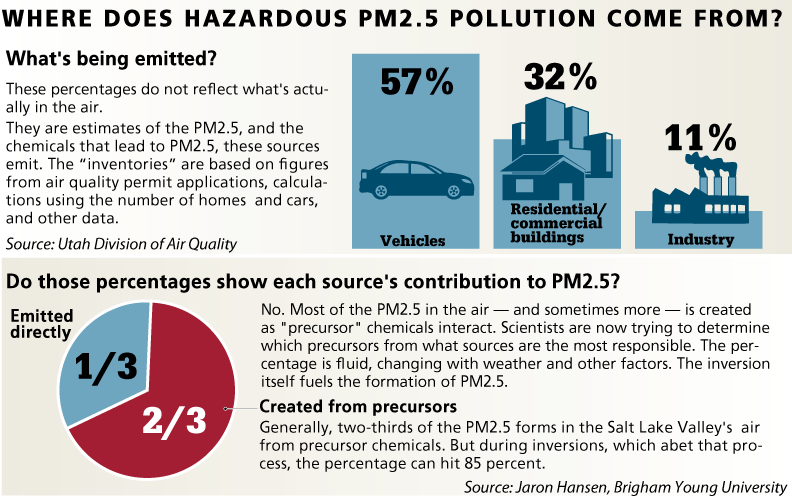

```{r}
root = "C:/Users/aalexander/Documents/Personal/utah_air_quality2"
```

Utah Air Quality
=========

Goal
----
Demonstrate an approachable example of an end to end data science project with Utah air quality.

Overview
----
- Define the problem
- Hypothesis
- Collect meta data
- Extract raw data
- Clean and mung raw data
- Data exploration
- Merge and Preview of insights
- Machine learning
- Summary of results

Define the problem
-----
Acording to several sources, vehicle emissions are said to be the major contributor to air quality. (http://www.sltrib.com/sltrib/politics/57159228-90/utah-quality-pollution-lake.html.csp) The picture below from the Salt Lake Tribune in 2013 shows estimates that indicate vehicles are a major contributor to PM2.5 directly and indirectly by the polutants that the emit that react to form PM2.5 particulates.



There are four major [pollutants that come from cars](https://www.google.com/search?q=what+pollutants+come+from+vehicle+emissions&ie=utf-8&oe=utf-8&aq=t&rls=org.mozilla:en-US:unofficial&client=firefox-a&gws_rd=ssl#q=what+pollutants+come+from+vehicle+emissions&rls=org.mozilla:en-US:unofficial&spell=1):

- A car emits carbon monoxide when the carbon in fuel doesn't burn completely.
- A car's exhaust emits hydrocarbons, a toxic compound of hydrogen and carbon.
- When fuel burns, nitrogen and oxygen react with each other and form nitrogen oxides (NOx).
- Particulate matter -- small particles of foreign substances -- in the air contribute to atmospheric haze and can damage people’s lungs.

Already there is significant research including an entire [subdivision of EPA](http://www.epa.gov/airscience/air-highwayresearch.htm) dedicated to air quality near major roadways. Their website includes a list of objectives and the following key scientific questions:

- How do traffic and roadway emissions affect exposures and adverse health effects for populations living, working, or going to school near roads?
- What kinds of air pollution have negative effects on human health?
- What decision tools are available or can be produced that can be used in regulatory decision-making as well as transportation and community planning?
- Do public facilities located near major roadways present an exposure and health risk to their occupants?

The EPA monitors the levels of SO2, CO, and NO2 which are all biproducts of vehicle emissions. These critical gasses as well as others vehicle emissions are some of the significant precursors that contribute to Ozone and PM2.5.


Hypothesis
---
There is a correlation between traffic patterns and observable air quality metrics.


Collect meta data
---------

According to the same article above and from the EPA website there are [several monitoring stations in Utah](http://www.arcgis.com/home/webmap/viewer.html?webmap=3674d8377b5e4cec9d4ba12f228e44f0&extent=-114.4571,38.8975,-108.6673,42.3159).

Data for these monitoring stations can be downloaded from [epa.gov](http://aqsdr1.epa.gov/aqsweb/aqstmp/airdata/download_files.html)

First, we identify the location of these measuring stations. Code is shown in R unless otherwise specified.

```{r}
# download air quality metrics data using R
#download.file("http://aqsdr1.epa.gov/aqsweb/aqstmp/airdata/annual_all_2014.zip", destfile="Documents/utah_air_quality/extract_epa_data/data/annual_all_2014.zip")
# load dataset into workspace
#unzip("Documents/utah_air_quality/extract_epa_data/data/annual_all_2014.zip",exdir="Documents/utah_air_quality/extract_epa_data/data/")
getwd()
data = read.csv(paste(root,"utah_air_quality/extract_epa_data/data/annual_all_2014.csv",sep="/"))
# filter data
data = data[data$State.Name=="Utah",]
data = data[data$County.Name %in% c("Salt Lake","Utah","Davis","Weber","Summit"),]
head(data)

# summarize by location
table(factor(paste(data$Local.Site.Name,data$City.Name,sep=", ")))

# summarize by parameter
table(factor(data[,c("Parameter.Name")]))

# which locations have key parameters
data = data[data$Parameter.Name %in% c("Nitrogen dioxide (NO2)","Carbon monoxide","Sulfur dioxide", "PM2.5 - Local Conditions"),]

# slice by durration
table(factor(data$Local.Site.Name),factor(data[,c("Parameter.Name")]),factor(data$Sample.Duration))

# filter by locations with hourly samples
data = data[data$Sample.Duration=="1 HOUR",]

# collect the unique stations
air_quality_stations = unique(data[,c("Local.Site.Name","Latitude","Longitude")])
```

Second, we find all available traffic monitoring stations and rank them by proximity to available air quality monitors. 

```{r}
# load locations of all relavant traffic stations
stations = read.table(paste(root,"utah_air_quality/extract_udot_pems_data/data/I15N-post-mile-to-lat-long",sep="/"),sep="\t",header=T)
head(stations)

# identiy traffic stations near air quality stations
site="Hawthorne"
stations$test_lat = air_quality_stations[air_quality_stations$Local.Site.Name==site,"Latitude"]
stations$test_lon = air_quality_stations[air_quality_stations$Local.Site.Name==site,"Longitude"]
stations$relative_distances = (stations$Latitude-stations$test_lat)^2 + (stations$Longitude-stations$test_lon)^2
# remove anything missing a distance
stations = stations[which(!is.na(stations$relative_distances)),]

# load and merge lookup table of traffic station ids
# http://udot.bt-systems.com/?report_form=1&dnode=State&content=elv&tab=controllers&export=text&_time_id=1406851200&_mm=8&_dd=1&_yy=2014&eqpo=
udot_stations = read.table(paste(root,"utah_air_quality/extract_udot_pems_data/data/traffic_station_with_id.tsv",sep="/"),sep="\t",header=T)
stations_m = merge(udot_stations,stations,all.y=T,by=c("State.PM","Abs.PM"))
stations_m$Nearest = site

# 10 closest stations
stations_m = stations_m[stations_m$Type=="Mainline",]
stations_m = stations_m[which(!is.na(stations_m$ID)),]
traffic_stations = stations_m[order(stations_m$relative_distances),][1:10,]
```

Now we have a short list of stations of interest for each observed polutant and a short list of observable traffic sources near each.

```{r}
# list monitoring stations
air_quality_stations
# part of the list of traffic stations and their coordinates near those monitoring stations
traffic_stations[,c("Fwy","Name","Lanes","ID","Latitude","Longitude","relative_distances","Nearest")]
```


Extract raw data
------

It has been shown that the extraction and storage of such datasets requires specialized skills and sufficient storage resources. I have provided a python script for the extraction of PeMS in utah_air_quality/extract_udot_pems_data/.

Next we load the raw data from a subset of these locations without loss of generality. Likewise we begin with the extraction of daily data but it should be noted that more interesting traffic patterns can be observed at on an hourly basis.

```{r}
# load raw air quality data location
#unzip("Documents/utah_air_quality/extract_epa_data/data/daily_42602_2014.zip",exdir="Documents/utah_air_quality/extract_epa_data/data/")
data = read.csv(paste(root,"utah_air_quality/extract_epa_data/data/daily_42602_2014.csv",sep="/"))

# Most recent air quality data availability
availability = '2014-06-13'

# load raw traffic data from two locations
station_428 = read.csv(paste(root,"utah_air_quality/extract_udot_pems_data/data/station_428.tsv",sep="/"),header=T,sep="\t")
station_516 = read.csv(paste(root,"utah_air_quality/extract_udot_pems_data/data/station_516.tsv",sep="/"),header=T,sep="\t")


```


Clean and mung raw data
----

Select only the air quality data we need.
```{r}
data = data[data$Local.Site.Name==site,]
```


Data exploration
----

Preview and plot both datasets over time.

```{r}

data$Date.Local = as.Date(data$Date.Local)
with(data, plot(Date.Local,Arithmetic.Mean))

station_428$Day = as.Date(station_428$Day,format="%m/%d/%Y")
with(station_428, plot(Day,Flow..Veh.Day.))

```

Merge and Preview of insights
----

```{r}
master = merge(station_428,data,by.x="Day",by.y="Date.Local")
head(master)
```

Machine learning
----

Now that we have the dataset available lets compute the correlation using a simple linear model.

```{r}
# linear model
fit = lm(Arithmetic.Mean~Flow..Veh.Day.,data=master)
summary(fit)

plot(master$Arithmetic.Mean~master$Flow..Veh.Day.)
abline(fit)

```

Summary of results
----


Questions and next steps
---
- Is this pattern consistent? More locations!
- Is there a delayed response? Investigate hourly!
- How are other factors like climate related?
- What is the ultimate impact on human life like asthma?
- Are there specific patterns or behaviors that could be avoided (like rush hour, congestion, delays, or major accidents) that contribute to the effects?


