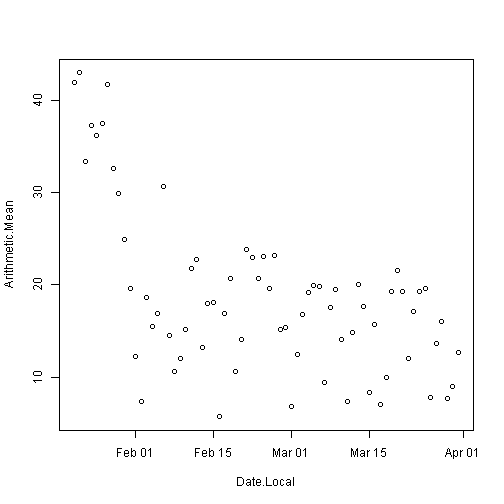
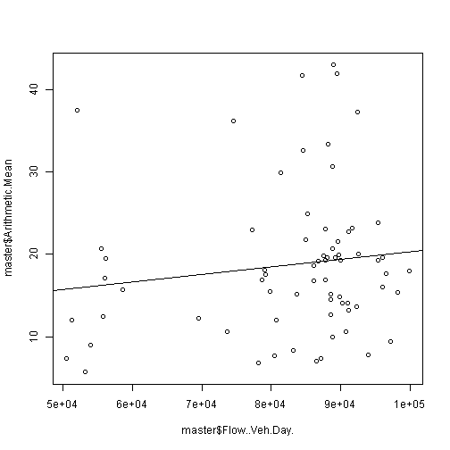

```r
root = "C:/Users/aalexander/Documents/Personal/utah_air_quality2"
```


Utah Air Quality
=========

Goal
----
Demonstrate an approachable example of an end to end data science project with Utah air quality.

Overview
----
- Define the problem
- Hypothesis
- Collect meta data
- Extract raw data
- Clean and mung raw data
- Data exploration
- Merge and Preview of insights
- Machine learning
- Summary of results

Define the problem
-----
Acording to several sources, vehicle emissions are said to be the major contributor to air quality. (http://www.sltrib.com/sltrib/politics/57159228-90/utah-quality-pollution-lake.html.csp) The picture below from the Salt Lake Tribune in 2013 shows estimates that indicate vehicles are a major contributor to PM2.5 directly and indirectly by the polutants that the emit that react to form PM2.5 particulates.


There are four major [pollutants that come from cars](https://www.google.com/search?q=what+pollutants+come+from+vehicle+emissions&ie=utf-8&oe=utf-8&aq=t&rls=org.mozilla:en-US:unofficial&client=firefox-a&gws_rd=ssl#q=what+pollutants+come+from+vehicle+emissions&rls=org.mozilla:en-US:unofficial&spell=1):

- A car emits carbon monoxide when the carbon in fuel doesn't burn completely.
- A car's exhaust emits hydrocarbons, a toxic compound of hydrogen and carbon.
- When fuel burns, nitrogen and oxygen react with each other and form nitrogen oxides (NOx).
- Particulate matter -- small particles of foreign substances -- in the air contribute to atmospheric haze and can damage people’s lungs.

Already there is significant research including an entire [subdivision of EPA](http://www.epa.gov/airscience/air-highwayresearch.htm) dedicated to air quality near major roadways. Their website includes a list of objectives and the following key scientific questions:

- How do traffic and roadway emissions affect exposures and adverse health effects for populations living, working, or going to school near roads?
- What kinds of air pollution have negative effects on human health?
- What decision tools are available or can be produced that can be used in regulatory decision-making as well as transportation and community planning?
- Do public facilities located near major roadways present an exposure and health risk to their occupants?

The EPA monitors the levels of SO2, CO, and NO2 which are all biproducts of vehicle emissions. These critical gasses as well as others vehicle emissions are some of the significant precursors that contribute to Ozone and PM2.5.


Hypothesis
---
There is a correlation between traffic patterns and observable air quality metrics.


Collect meta data
---------

According to the same article above and from the EPA website there are [several monitoring stations in Utah](http://www.arcgis.com/home/webmap/viewer.html?webmap=3674d8377b5e4cec9d4ba12f228e44f0&extent=-114.4571,38.8975,-108.6673,42.3159).

Data for these monitoring stations can be downloaded from [epa.gov](http://aqsdr1.epa.gov/aqsweb/aqstmp/airdata/download_files.html)

First, we identify the location of these measuring stations. Code is shown in R unless otherwise specified.


```r
# download air quality metrics data using R
# download.file('http://aqsdr1.epa.gov/aqsweb/aqstmp/airdata/annual_all_2014.zip',
# destfile='Documents/utah_air_quality/extract_epa_data/data/annual_all_2014.zip')
# load dataset into workspace
# unzip('Documents/utah_air_quality/extract_epa_data/data/annual_all_2014.zip',exdir='Documents/utah_air_quality/extract_epa_data/data/')
getwd()
```

```
## [1] "C:/Users/aalexander/Documents/Personal/utah_air_quality2/utah_air_quality/analysis"
```

```r
data = read.csv(paste(root, "utah_air_quality/extract_epa_data/data/annual_all_2014.csv", 
    sep = "/"))
# filter data
data = data[data$State.Name == "Utah", ]
data = data[data$County.Name %in% c("Salt Lake", "Utah", "Davis", "Weber", "Summit"), 
    ]
head(data)
```

```
##       State.Code County.Code Site.Num Parameter.Code POC Latitude
## 36474         49          11        4          17141   6     40.9
## 36475         49          11        4          17147   6     40.9
## 36476         49          11        4          17148   6     40.9
## 36477         49          11        4          17149   6     40.9
## 36478         49          11        4          17150   6     40.9
## 36479         49          11        4          17151   6     40.9
##       Longitude Datum           Parameter.Name Sample.Duration
## 36474    -111.9 WGS84    Naphthalene (TSP) STP         24 HOUR
## 36475    -111.9 WGS84   Acenaphthene (TSP) STP         24 HOUR
## 36476    -111.9 WGS84 Acenaphthylene (TSP) STP         24 HOUR
## 36477    -111.9 WGS84       Fluorene (TSP) STP         24 HOUR
## 36478    -111.9 WGS84   Phenanthrene (TSP) STP         24 HOUR
## 36479    -111.9 WGS84     Anthracene (TSP) STP         24 HOUR
##       Pollutant.Standard     Metric.Used                   Method.Name
## 36474                    Observed Values Hi Vol/PUF-XAD-2 - GCMS TO-13
## 36475                    Observed Values Hi Vol/PUF-XAD-2 - GCMS TO-13
## 36476                    Observed Values Hi Vol/PUF-XAD-2 - GCMS TO-13
## 36477                    Observed Values Hi Vol/PUF-XAD-2 - GCMS TO-13
## 36478                    Observed Values Hi Vol/PUF-XAD-2 - GCMS TO-13
## 36479                    Observed Values Hi Vol/PUF-XAD-2 - GCMS TO-13
##       Year             Units.of.Measure Event.Type Observation.Count
## 36474 2014 Nanograms/cubic meter (25 C)  No Events                14
## 36475 2014 Nanograms/cubic meter (25 C)  No Events                14
## 36476 2014 Nanograms/cubic meter (25 C)  No Events                14
## 36477 2014 Nanograms/cubic meter (25 C)  No Events                14
## 36478 2014 Nanograms/cubic meter (25 C)  No Events                14
## 36479 2014 Nanograms/cubic meter (25 C)  No Events                14
##       Observation.Percent Valid.Day.Count Required.Day.Count
## 36474                  23              13                 61
## 36475                  23              13                 61
## 36476                  23              13                 61
## 36477                  23              13                 61
## 36478                  23              13                 61
## 36479                  23              13                 61
##       Exceptional.Data.Count Null.Data.Count Primary.Exceedance.Count
## 36474                      0               2                       NA
## 36475                      0               2                       NA
## 36476                      0               2                       NA
## 36477                      0               2                       NA
## 36478                      0               2                       NA
## 36479                      0               2                       NA
##       Secondary.Exceedance.Count    Certification.Indicator
## 36474                         NA Certification not required
## 36475                         NA Certification not required
## 36476                         NA Certification not required
## 36477                         NA Certification not required
## 36478                         NA Certification not required
## 36479                         NA Certification not required
##       Num.Obs.Below.MDL Arithmetic.Mean Arithmetic.Standard.Dev
## 36474                 0         50.1500                 38.4230
## 36475                 0          1.2511                  0.7889
## 36476                 0          1.6380                  2.3838
## 36477                 0          1.0293                  1.5419
## 36478                 0          3.0390                  1.8949
## 36479                 0          0.3795                  0.2923
##       X1st.Max.Value X1st.Max.DateTime X2nd.Max.Value X2nd.Max.DateTime
## 36474        147.000  2014-01-17 00:00         89.700  2014-01-29 00:00
## 36475          2.700  2014-01-17 00:00          2.360  2014-01-23 00:00
## 36476          8.000  2014-01-23 00:00          4.730  2014-01-17 00:00
## 36477          3.810  2014-01-23 00:00          3.740  2014-01-17 00:00
## 36478          6.260  2014-01-23 00:00          5.200  2014-01-05 00:00
## 36479          0.953  2014-01-23 00:00          0.922  2014-03-30 00:00
##       X3rd.Max.Value X3rd.Max.DateTime X4th.Max.Value X4th.Max.DateTime
## 36474         81.700  2014-01-05 00:00         79.200  2014-01-23 00:00
## 36475          2.120  2014-01-29 00:00          1.720  2014-01-05 00:00
## 36476          4.500  2014-01-05 00:00          1.300  2014-02-22 00:00
## 36477          3.150  2014-01-05 00:00          2.320  2014-01-11 00:00
## 36478          4.850  2014-01-17 00:00          4.710  2014-01-29 00:00
## 36479          0.612  2014-01-05 00:00          0.606  2014-01-17 00:00
##       X1st.Max.Non.Overlapping.Value X1st.NO.Max.DateTime
## 36474                             NA                     
## 36475                             NA                     
## 36476                             NA                     
## 36477                             NA                     
## 36478                             NA                     
## 36479                             NA                     
##       X2nd.Max.Non.Overlapping.Value X2nd.NO.Max.DateTime X99th.Percentile
## 36474                             NA                               147.000
## 36475                             NA                                 2.700
## 36476                             NA                                 8.000
## 36477                             NA                                 3.810
## 36478                             NA                                 6.260
## 36479                             NA                                 0.953
##       X98th.Percentile X95th.Percentile X90th.Percentile X75th.Percentile
## 36474          147.000          147.000           89.700           79.200
## 36475            2.700            2.700            2.360            1.720
## 36476            8.000            8.000            4.730            1.300
## 36477            3.810            3.810            3.740            2.320
## 36478            6.260            6.260            5.200            4.710
## 36479            0.953            0.953            0.922            0.606
##       X50th.Percentile X10th.Percentile    Local.Site.Name
## 36474           48.800          13.6000 Bountiful Viewmont
## 36475            1.030           0.4170 Bountiful Viewmont
## 36476            0.694           0.0000 Bountiful Viewmont
## 36477            0.000           0.0000 Bountiful Viewmont
## 36478            3.510           1.0900 Bountiful Viewmont
## 36479            0.305           0.0934 Bountiful Viewmont
##                                    Address State.Name County.Name
## 36474 171 WEST 1370 NORTH, BOUNTIFUL, UTAH       Utah       Davis
## 36475 171 WEST 1370 NORTH, BOUNTIFUL, UTAH       Utah       Davis
## 36476 171 WEST 1370 NORTH, BOUNTIFUL, UTAH       Utah       Davis
## 36477 171 WEST 1370 NORTH, BOUNTIFUL, UTAH       Utah       Davis
## 36478 171 WEST 1370 NORTH, BOUNTIFUL, UTAH       Utah       Davis
## 36479 171 WEST 1370 NORTH, BOUNTIFUL, UTAH       Utah       Davis
##       City.Name            CBSA.Name Date.of.Last.Change
## 36474 Bountiful Ogden-Clearfield, UT          2014-06-10
## 36475 Bountiful Ogden-Clearfield, UT          2014-06-10
## 36476 Bountiful Ogden-Clearfield, UT          2014-06-10
## 36477 Bountiful Ogden-Clearfield, UT          2014-06-10
## 36478 Bountiful Ogden-Clearfield, UT          2014-06-10
## 36479 Bountiful Ogden-Clearfield, UT          2014-06-10
```

```r

# summarize by location
table(factor(paste(data$Local.Site.Name, data$City.Name, sep = ", ")))
```

```
## 
##                                Bountiful Viewmont, Bountiful 
##                                                          251 
##                                     Harrisville, Harrisville 
##                                                            2 
##                                    Hawthorne, Salt Lake City 
##                                                           93 
##                                               Lindon, Lindon 
##                                                           92 
##                                                 Magna, Magna 
##                                                           18 
##                                           North Provo, Provo 
##                                                           29 
##                                                 Ogden, Ogden 
##                                                           27 
##                                    ROSE PARK, Salt Lake City 
##                                                           26 
##                                   Spanish Fork, Spanish Fork 
##                                                           16 
##                  UTM COORDINATES AT MET TOWER, Not in a city 
##                                                            6 
##                       UTM COORDINATES AT MET TOWER, Syracuse 
##                                                            6 
##             UTM COORDINATES AT PROBE LOCATION, Not in a city 
##                                                            3 
## UTM COORDINATES TAKEN FROM MET TOWER LOCATION, Not in a city 
##                                                            5 
##                                     WEST JORDAN, West Jordan 
##                                                            5
```

```r

# summarize by parameter
table(factor(data[, c("Parameter.Name")]))
```

```
## 
##                                  1-Decene 
##                                         1 
##                                 1-Heptene 
##                                         1 
##                                  1-Hexene 
##                                         1 
##                                  1-Nonene 
##                                         1 
##                                  1-Octene 
##                                         1 
##                                 1-Pentene 
##                                         1 
##                                1-Undecene 
##                                         1 
##                        1,1-Dichloroethane 
##                                         1 
##                      1,1-Dichloroethylene 
##                                         1 
##     1,1,2-Trichloro-1,2,2-trifluoroethane 
##                                         1 
##                     1,1,2-Trichloroethane 
##                                         1 
##                 1,1,2,2-Tetrachloroethane 
##                                         1 
##                       1,2-Dichlorobenzene 
##                                         1 
##                       1,2-Dichloropropane 
##                                         1 
##                    1,2,3-Trimethylbenzene 
##                                         1 
##                    1,2,4-Trichlorobenzene 
##                                         1 
##                    1,2,4-Trimethylbenzene 
##                                         2 
##                             1,3-Butadiene 
##                                         2 
##                       1,3-Dichlorobenzene 
##                                         1 
##                    1,3,5-Trimethylbenzene 
##                                         2 
##                       1,4-Dichlorobenzene 
##                                         1 
##                    2-2-3-Trimethylpentane 
##                                         1 
##                          2-Ethyl-1-butene 
##                                         1 
##                         2-Methyl-1-butene 
##                                         1 
##                        2-Methyl-1-pentene 
##                                         1 
##                         2-Methyl-2-butene 
##                                         1 
##                           2-Methylheptane 
##                                         1 
##                            2-Methylhexane 
##                                         1 
##                           2-Methylpentane 
##                                         1 
##                        2,2-Dimethylbutane 
##                                         1 
##                    2,2,4-Trimethylpentane 
##                                         1 
##                        2,3-Dimethylbutane 
##                                         1 
##                       2,3-Dimethylpentane 
##                                         1 
##                    2,3,4-Trimethylpentane 
##                                         1 
##                       2,4-Dimethylpentane 
##                                         1 
##                  2,5-Dimethylbenzaldehyde 
##                                         1 
##                         3-Methyl-1-butene 
##                                         1 
##                           3-Methylheptane 
##                                         1 
##                            3-Methylhexane 
##                                         1 
##                           3-Methylpentane 
##                                         1 
##                        4-Methyl-1-pentene 
##                                         1 
##                    9-fluorenone (TSP) STP 
##                                         1 
##    Acceptable PM2.5 AQI & Speciation Mass 
##                                        11 
##                    Acenaphthene (TSP) STP 
##                                         1 
##                  Acenaphthylene (TSP) STP 
##                                         1 
##                              Acetaldehyde 
##                                         1 
##                                   Acetone 
##                                         1 
##                              Acetonitrile 
##                                         1 
##                                 Acetylene 
##                                         2 
##                     Acrolein - Unverified 
##                                         1 
##                             Acrylonitrile 
##                                         1 
##                             alpha.-Pinene 
##                                         1 
##                         Aluminum PM2.5 LC 
##                                         3 
##                   Ambient Max Temperature 
##                                        13 
##                   Ambient Min Temperature 
##                                        13 
##                       Ambient Temperature 
##                                        13 
##                     Ammonium Ion PM2.5 LC 
##                                         3 
##                      Anthracene (TSP) STP 
##                                         1 
##                         Antimony PM2.5 LC 
##                                         3 
##                          Arsenic PM2.5 LC 
##                                         3 
##                           Barium PM2.5 LC 
##                                         3 
##                       Barometric pressure 
##                                         1 
##                              Benzaldehyde 
##                                         1 
##                                   Benzene 
##                                         2 
##               Benzene, 1-ethenyl-4-methyl 
##                                         1 
##              Benzo[a]anthracene (TSP) STP 
##                                         1 
##                  Benzo[a]pyrene (TSP) STP 
##                                         1 
##            Benzo[b]fluoranthene (TSP) STP 
##                                         1 
##                  Benzo[e]pyrene (TSP) STP 
##                                         1 
##            Benzo[g,h,i]perylene (TSP) STP 
##                                         1 
##            Benzo[k]fluoranthene (TSP) STP 
##                                         1 
##                              beta.-Pinene 
##                                         1 
##                          Bromine PM2.5 LC 
##                                         3 
##                        Bromochloromethane 
##                                         1 
##                      Bromodichloromethane 
##                                         1 
##                                 Bromoform 
##                                         1 
##                              Bromomethane 
##                                         1 
##                             Butyraldehyde 
##                                         1 
##                          Cadmium PM2.5 LC 
##                                         3 
##                          Calcium PM2.5 LC 
##                                         3 
##                          Carbon disulfide 
##                                         1 
##                           Carbon monoxide 
##                                         6 
##                      Carbon tetrachloride 
##                                         1 
##                           Cerium PM2.5 LC 
##                                         3 
##                           Cesium PM2.5 LC 
##                                         3 
##                         Chlorine PM2.5 LC 
##                                         3 
##                             Chlorobenzene 
##                                         1 
##                              Chloroethane 
##                                         1 
##                                Chloroform 
##                                         1 
##                             Chloromethane 
##                                         1 
##                               Chloroprene 
##                                         1 
##                         Chromium PM2.5 LC 
##                                         3 
##                        Chrysene (TSP) STP 
##                                         1 
##                    cis-1,2-Dichloroethene 
##                                         1 
##                   cis-1,3-Dichloropropene 
##                                         1 
##                              cis-2-Butene 
##                                         1 
##                              cis-2-Hexene 
##                                         1 
##                             cis-2-Pentene 
##                                         1 
##                           Cobalt PM2.5 LC 
##                                         3 
##                           Copper PM2.5 LC 
##                                         3 
##                        Coronene (TSP) STP 
##                                         1 
##                            Crotonaldehyde 
##                                         1 
##                               Cyclohexane 
##                                         1 
##            Cyclopenta[cd]pyrene (TSP) STP 
##                                         1 
##                              Cyclopentane 
##                                         1 
##                              Cyclopentene 
##                                         1 
##          Dibenzo[a,h]anthracene (TSP) STP 
##                                         1 
##                      Dibromochloromethane 
##                                         1 
##                   Dichlorodifluoromethane 
##                                         1 
##                           Dichloromethane 
##                                         1 
##                                  Dodecene 
##                                         1 
##        EC CSN_Rev Unadjusted PM2.5 LC TOR 
##                                         3 
##        EC CSN_Rev Unadjusted PM2.5 LC TOT 
##                                         3 
##           EC1 CSN_Rev Unadjusted PM2.5 LC 
##                                         3 
##           EC2 CSN_Rev Unadjusted PM2.5 LC 
##                                         3 
##           EC3 CSN_Rev Unadjusted PM2.5 LC 
##                                         3 
##                       Elapsed Sample Time 
##                                        10 
##                                    Ethane 
##                                         1 
##                            Ethyl acrylate 
##                                         1 
##                              Ethylbenzene 
##                                         2 
##                                  Ethylene 
##                                         1 
##                        Ethylene dibromide 
##                                         1 
##                       Ethylene dichloride 
##                                         1 
##                    Fluoranthene (TSP) STP 
##                                         1 
##                        Fluorene (TSP) STP 
##                                         1 
##                              Formaldehyde 
##                                         1 
##                                 Freon 114 
##                                         1 
##                       Hexachlorobutadiene 
##                                         1 
##                             Hexanaldehyde 
##                                         1 
##          Indeno[1,2,3-cd]pyrene (TSP) STP 
##                                         1 
##                           Indium PM2.5 LC 
##                                         3 
##                             Iron PM2.5 LC 
##                                         3 
##                                 Isobutane 
##                                         1 
##                                Isopentane 
##                                         1 
##                                  Isoprene 
##                                         1 
##                          Isopropylbenzene 
##                                         1 
##                          Isovaleraldehyde 
##                                         1 
##                             Lead PM2.5 LC 
##                                         3 
##                          m-Diethylbenzene 
##                                         1 
##                            m-Ethyltoluene 
##                                         1 
##                                m/p Xylene 
##                                         2 
##                        Magnesium PM2.5 LC 
##                                         3 
##                        Manganese PM2.5 LC 
##                                         3 
##                         Methyl chloroform 
##                                         1 
##                       Methyl ethyl ketone 
##                                         1 
##                    Methyl isobutyl ketone 
##                                         1 
##                       Methyl methacrylate 
##                                         1 
##                   Methyl tert-butyl ether 
##                                         1 
##                         Methylcyclohexane 
##                                         1 
##                        Methylcyclopentane 
##                                         1 
##                                  n-Butane 
##                                         1 
##                                  n-Decane 
##                                         1 
##                                n-Dodecane 
##                                         1 
##                                 n-Heptane 
##                                         1 
##                                  n-Hexane 
##                                         1 
##                                  n-Nonane 
##                                         1 
##                                  n-Octane 
##                                         2 
##                                 n-Pentane 
##                                         1 
##                           n-Propylbenzene 
##                                         1 
##                               n-Tridecane 
##                                         1 
##                                n-Undecane 
##                                         1 
##                     Naphthalene (TSP) STP 
##                                         1 
##                           Nickel PM2.5 LC 
##                                         3 
##                         Nitric oxide (NO) 
##                                         5 
##                    Nitrogen dioxide (NO2) 
##                                         8 
##                                  NOy - NO 
##                                         1 
##                            o-Ethyltoluene 
##                                         1 
##                                  o-Xylene 
##                                         2 
##        OC CSN_Rev Unadjusted PM2.5 LC TOR 
##                                         3 
##        OC CSN_Rev Unadjusted PM2.5 LC TOT 
##                                         3 
##           OC1 CSN_Rev Unadjusted PM2.5 LC 
##                                         3 
##           OC2 CSN_Rev Unadjusted PM2.5 LC 
##                                         3 
##           OC3 CSN_Rev Unadjusted PM2.5 LC 
##                                         3 
##           OC4 CSN_Rev Unadjusted PM2.5 LC 
##                                         3 
##        OP CSN_Rev Unadjusted PM2.5 LC TOR 
##                                         3 
##        OP CSN_Rev Unadjusted PM2.5 LC TOT 
##                                         3 
##                       Outdoor Temperature 
##                                        11 
##                  Oxides of nitrogen (NOx) 
##                                         4 
##                          p-Diethylbenzene 
##                                         1 
##                        Perylene (TSP) STP 
##                                         1 
##                    Phenanthrene (TSP) STP 
##                                         1 
##                       Phosphorus PM2.5 LC 
##                                         3 
##                                 PM10 - LC 
##                                         6 
##                     PM10 Total 0-10um STP 
##                                         8 
##                  PM2.5 - Local Conditions 
##                                        40 
##                    Potassium Ion PM2.5 LC 
##                                         3 
##                        Potassium PM2.5 LC 
##                                         3 
##                                   Propane 
##                                         1 
##                           Propionaldehyde 
##                                         1 
##                                 Propylene 
##                                         2 
##                                   Propyne 
##                                         1 
##                          Pyrene (TSP) STP 
##                                         1 
##         Reactive oxides of nitrogen (NOy) 
##                                         1 
##                        Relative Humidity  
##                                         8 
##                          Retene (TSP) STP 
##                                         1 
##                         Rubidium PM2.5 LC 
##                                         3 
##                      Sample Baro Pressure 
##                                        13 
##                      Sample Flow Rate- CV 
##                                        10 
##                  Sample Max Baro Pressure 
##                                        13 
##                  Sample Min Baro Pressure 
##                                        13 
##                             Sample Volume 
##                                        10 
##                         Selenium PM2.5 LC 
##                                         3 
##                          Silicon PM2.5 LC 
##                                         3 
##                           Silver PM2.5 LC 
##                                         3 
##                       Sodium Ion Pm2.5 LC 
##                                         3 
##                           Sodium PM2.5 LC 
##                                         3 
##                           Solar radiation 
##                                         2 
##                 Std Dev Hz Wind Direction 
##                                         4 
##                        Strontium PM2.5 LC 
##                                         3 
##                                   Styrene 
##                                         2 
##                          Sulfate PM2.5 LC 
##                                         3 
##                            Sulfur dioxide 
##                                         5 
##                           Sulfur PM2.5 LC 
##                                         3 
##                    Tert-amyl methyl ether 
##                                         1 
##                    tert-Butyl ethyl ether 
##                                         1 
##                       Tetrachloroethylene 
##                                         1 
##                              Tin PM2.5 LC 
##                                         3 
##                         Titanium PM2.5 LC 
##                                         3 
##                             Tolualdehydes 
##                                         1 
##                                   Toluene 
##                                         2 
##                    Total Nitrate PM2.5 LC 
##                                         3 
## Total NMOC (non-methane organic compound) 
##                                         1 
##                trans-1,2-Dichloroethylene 
##                                         1 
##                 trans-1,3-Dichloropropene 
##                                         1 
##                            trans-2-Butene 
##                                         1 
##                            trans-2-Hexene 
##                                         1 
##                           trans-2-Pentene 
##                                         1 
##                         Trichloroethylene 
##                                         1 
##                    Trichlorofluoromethane 
##                                         1 
##                                 Tridecene 
##                                         1 
##                             Valeraldehyde 
##                                         1 
##                         Vanadium PM2.5 LC 
##                                         3 
##                            Vinyl chloride 
##                                         1 
##                   Wind Direction - Scalar 
##                                        13 
##                       Wind Speed - Scalar 
##                                        13 
##                             Zinc PM2.5 LC 
##                                         3 
##                        Zirconium PM2.5 LC 
##                                         3
```

```r

# which locations have key parameters
data = data[data$Parameter.Name %in% c("Nitrogen dioxide (NO2)", "Carbon monoxide", 
    "Sulfur dioxide", "PM2.5 - Local Conditions"), ]

# slice by durration
table(factor(data$Local.Site.Name), factor(data[, c("Parameter.Name")]), factor(data$Sample.Duration))
```

```
## , ,  = 1 HOUR
## 
##                     
##                      Carbon monoxide Nitrogen dioxide (NO2)
##   Bountiful Viewmont               0                      2
##   Hawthorne                        1                      2
##   Lindon                           0                      0
##   Magna                            0                      0
##   North Provo                      1                      2
##   Ogden                            1                      2
##   ROSE PARK                        0                      0
##   Spanish Fork                     0                      0
##                     
##                      PM2.5 - Local Conditions Sulfur dioxide
##   Bountiful Viewmont                        0              0
##   Hawthorne                                 0              2
##   Lindon                                    0              0
##   Magna                                     0              0
##   North Provo                               0              0
##   Ogden                                     0              0
##   ROSE PARK                                 0              0
##   Spanish Fork                              0              0
## 
## , ,  = 24-HR BLK AVG
## 
##                     
##                      Carbon monoxide Nitrogen dioxide (NO2)
##   Bountiful Viewmont               0                      0
##   Hawthorne                        0                      0
##   Lindon                           0                      0
##   Magna                            0                      0
##   North Provo                      0                      0
##   Ogden                            0                      0
##   ROSE PARK                        0                      0
##   Spanish Fork                     0                      0
##                     
##                      PM2.5 - Local Conditions Sulfur dioxide
##   Bountiful Viewmont                        0              0
##   Hawthorne                                 0              1
##   Lindon                                    0              0
##   Magna                                     0              0
##   North Provo                               0              0
##   Ogden                                     0              0
##   ROSE PARK                                 0              0
##   Spanish Fork                              0              0
## 
## , ,  = 24 HOUR
## 
##                     
##                      Carbon monoxide Nitrogen dioxide (NO2)
##   Bountiful Viewmont               0                      0
##   Hawthorne                        0                      0
##   Lindon                           0                      0
##   Magna                            0                      0
##   North Provo                      0                      0
##   Ogden                            0                      0
##   ROSE PARK                        0                      0
##   Spanish Fork                     0                      0
##                     
##                      PM2.5 - Local Conditions Sulfur dioxide
##   Bountiful Viewmont                        4              0
##   Hawthorne                                 4              0
##   Lindon                                    8              0
##   Magna                                     4              0
##   North Provo                               4              0
##   Ogden                                     4              0
##   ROSE PARK                                 8              0
##   Spanish Fork                              4              0
## 
## , ,  = 3-HR BLK AVG
## 
##                     
##                      Carbon monoxide Nitrogen dioxide (NO2)
##   Bountiful Viewmont               0                      0
##   Hawthorne                        0                      0
##   Lindon                           0                      0
##   Magna                            0                      0
##   North Provo                      0                      0
##   Ogden                            0                      0
##   ROSE PARK                        0                      0
##   Spanish Fork                     0                      0
##                     
##                      PM2.5 - Local Conditions Sulfur dioxide
##   Bountiful Viewmont                        0              0
##   Hawthorne                                 0              1
##   Lindon                                    0              0
##   Magna                                     0              0
##   North Provo                               0              0
##   Ogden                                     0              0
##   ROSE PARK                                 0              0
##   Spanish Fork                              0              0
## 
## , ,  = 5 MINUTE
## 
##                     
##                      Carbon monoxide Nitrogen dioxide (NO2)
##   Bountiful Viewmont               0                      0
##   Hawthorne                        0                      0
##   Lindon                           0                      0
##   Magna                            0                      0
##   North Provo                      0                      0
##   Ogden                            0                      0
##   ROSE PARK                        0                      0
##   Spanish Fork                     0                      0
##                     
##                      PM2.5 - Local Conditions Sulfur dioxide
##   Bountiful Viewmont                        0              0
##   Hawthorne                                 0              1
##   Lindon                                    0              0
##   Magna                                     0              0
##   North Provo                               0              0
##   Ogden                                     0              0
##   ROSE PARK                                 0              0
##   Spanish Fork                              0              0
## 
## , ,  = 8-HR RUN AVG END HOUR
## 
##                     
##                      Carbon monoxide Nitrogen dioxide (NO2)
##   Bountiful Viewmont               0                      0
##   Hawthorne                        1                      0
##   Lindon                           0                      0
##   Magna                            0                      0
##   North Provo                      1                      0
##   Ogden                            1                      0
##   ROSE PARK                        0                      0
##   Spanish Fork                     0                      0
##                     
##                      PM2.5 - Local Conditions Sulfur dioxide
##   Bountiful Viewmont                        0              0
##   Hawthorne                                 0              0
##   Lindon                                    0              0
##   Magna                                     0              0
##   North Provo                               0              0
##   Ogden                                     0              0
##   ROSE PARK                                 0              0
##   Spanish Fork                              0              0
```

```r

# filter by locations with hourly samples
data = data[data$Sample.Duration == "1 HOUR", ]

# collect the unique stations
air_quality_stations = unique(data[, c("Local.Site.Name", "Latitude", "Longitude")])
```


Second, we find all available traffic monitoring stations and rank them by proximity to available air quality monitors. 


```r
# load locations of all relavant traffic stations
stations = read.table(paste(root, "utah_air_quality/extract_udot_pems_data/data/I15N-post-mile-to-lat-long", 
    sep = "/"), sep = "\t", header = T)
head(stations)
```

```
##   District     County State.PM Abs.PM Length Latitude Longitude
## 1        1 Washington   -0.244 -0.244  0.010       37    -113.6
## 2        1 Washington   -0.233 -0.233  0.014       37    -113.6
## 3        1 Washington   -0.219 -0.219  0.029       37    -113.6
## 4        1 Washington   -0.190 -0.190  0.052       37    -113.6
## 5        1 Washington   -0.138 -0.138  0.095       37    -113.6
## 6        1 Washington   -0.043 -0.043  0.054       37    -113.6
```

```r

# identiy traffic stations near air quality stations
site = "Hawthorne"
stations$test_lat = air_quality_stations[air_quality_stations$Local.Site.Name == 
    site, "Latitude"]
stations$test_lon = air_quality_stations[air_quality_stations$Local.Site.Name == 
    site, "Longitude"]
stations$relative_distances = (stations$Latitude - stations$test_lat)^2 + (stations$Longitude - 
    stations$test_lon)^2
# remove anything missing a distance
stations = stations[which(!is.na(stations$relative_distances)), ]

# load and merge lookup table of traffic station ids
# http://udot.bt-systems.com/?report_form=1&dnode=State&content=elv&tab=controllers&export=text&_time_id=1406851200&_mm=8&_dd=1&_yy=2014&eqpo=
udot_stations = read.table(paste(root, "utah_air_quality/extract_udot_pems_data/data/traffic_station_with_id.tsv", 
    sep = "/"), sep = "\t", header = T)
stations_m = merge(udot_stations, stations, all.y = T, by = c("State.PM", "Abs.PM"))
stations_m$Nearest = site

# 10 closest stations
stations_m = stations_m[stations_m$Type == "Mainline", ]
stations_m = stations_m[which(!is.na(stations_m$ID)), ]
traffic_stations = stations_m[order(stations_m$relative_distances), ][1:10, 
    ]
```


Now we have a short list of stations of interest for each observed polutant and a short list of observable traffic sources near each.


```r
# list monitoring stations
air_quality_stations
```

```
##          Local.Site.Name Latitude Longitude
## 36498 Bountiful Viewmont    40.90    -111.9
## 36799          Hawthorne    40.74    -111.9
## 36992        North Provo    40.25    -111.7
## 37159              Ogden    41.21    -112.0
```

```r
# part of the list of traffic stations and their coordinates near those
# monitoring stations
traffic_stations[, c("Fwy", "Name", "Lanes", "ID", "Latitude", "Longitude", 
    "relative_distances", "Nearest")]
```

```
##        Fwy             Name Lanes  ID Latitude Longitude
## 5195 I15-N NB I-15 @ 1500 S     5 428    40.74    -111.9
## 5199 I15-S SB I-15 @ 1320 S     5 516    40.74    -111.9
## 5201 I15-N NB I-15 @ 1250 S     5 430    40.74    -111.9
## 5168 I15-N NB I-15 @ 2500 S     4 422    40.72    -111.9
## 5158 I15-S SB I-15 @ 2900 S     6 526    40.71    -111.9
## 5159 I15-N NB I-15 @ 2900 S     6 420    40.71    -111.9
## 5228 I15-S  SB I-15 @ 700 S     5 514    40.75    -111.9
## 5229 I15-N  NB I-15 @ 850 S     5 432    40.75    -111.9
## 5246 I15-N  NB I-15 @ 300 S     4 434    40.76    -111.9
## 5249 I15-S  SB I-15 @ 300 S     4 512    40.76    -111.9
##      relative_distances   Nearest
## 5195           0.001034 Hawthorne
## 5199           0.001045 Hawthorne
## 5201           0.001045 Hawthorne
## 5168           0.001455 Hawthorne
## 5158           0.001790 Hawthorne
## 5159           0.001790 Hawthorne
## 5228           0.001832 Hawthorne
## 5229           0.001832 Hawthorne
## 5246           0.002439 Hawthorne
## 5249           0.002439 Hawthorne
```


Extract raw data
------

It has been shown that the extraction and storage of such datasets requires specialized skills and sufficient storage resources. I have provided a python script for the extraction of PeMS in utah_air_quality/extract_udot_pems_data/.

Next we load the raw data from a subset of these locations without loss of generality. Likewise we begin with the extraction of daily data but it should be noted that more interesting traffic patterns can be observed at on an hourly basis.


```r
# load raw air quality data location
# unzip('Documents/utah_air_quality/extract_epa_data/data/daily_42602_2014.zip',exdir='Documents/utah_air_quality/extract_epa_data/data/')
data = read.csv(paste(root, "utah_air_quality/extract_epa_data/data/daily_42602_2014.csv", 
    sep = "/"))

# Most recent air quality data availability
availability = "2014-06-13"

# load raw traffic data from two locations
station_428 = read.csv(paste(root, "utah_air_quality/extract_udot_pems_data/data/station_428.tsv", 
    sep = "/"), header = T, sep = "\t")
station_516 = read.csv(paste(root, "utah_air_quality/extract_udot_pems_data/data/station_516.tsv", 
    sep = "/"), header = T, sep = "\t")

```


Clean and mung raw data
----

Select only the air quality data we need.

```r
data = data[data$Local.Site.Name == site, ]
```


Data exploration
----

Preview and plot both datasets over time.


```r

data$Date.Local = as.Date(data$Date.Local)
with(data, plot(Date.Local, Arithmetic.Mean))
```

 

```r

station_428$Day = as.Date(station_428$Day, format = "%m/%d/%Y")
with(station_428, plot(Day, Flow..Veh.Day.))
```

 


Merge and Preview of insights
----


```r
master = merge(station_428, data, by.x = "Day", by.y = "Date.Local")
head(master)
```

```
##          Day Flow..Veh.Day. X..Lane.Points..Veh.Day. X..Observed..Veh.Day.
## 1 2014-01-21          89494                     1152                    96
## 2 2014-01-22          88985                     1152                   100
## 3 2014-01-23          88218                     1152                    99
## 4 2014-01-24          92443                     1152                    99
## 5 2014-01-25          74600                     1152                   100
## 6 2014-01-26          52059                     1152                   100
##   State.Code County.Code Site.Num Parameter.Code POC Latitude Longitude
## 1         49          35     3006          42602   1    40.74    -111.9
## 2         49          35     3006          42602   1    40.74    -111.9
## 3         49          35     3006          42602   1    40.74    -111.9
## 4         49          35     3006          42602   1    40.74    -111.9
## 5         49          35     3006          42602   1    40.74    -111.9
## 6         49          35     3006          42602   1    40.74    -111.9
##   Datum         Parameter.Name Sample.Duration Pollutant.Standard
## 1 NAD83 Nitrogen dioxide (NO2)          1 HOUR         NO2 1-hour
## 2 NAD83 Nitrogen dioxide (NO2)          1 HOUR         NO2 1-hour
## 3 NAD83 Nitrogen dioxide (NO2)          1 HOUR         NO2 1-hour
## 4 NAD83 Nitrogen dioxide (NO2)          1 HOUR         NO2 1-hour
## 5 NAD83 Nitrogen dioxide (NO2)          1 HOUR         NO2 1-hour
## 6 NAD83 Nitrogen dioxide (NO2)          1 HOUR         NO2 1-hour
##    Units.of.Measure Event.Type Observation.Count Observation.Percent
## 1 Parts per billion       None                11                  46
## 2 Parts per billion       None                24                 100
## 3 Parts per billion       None                24                 100
## 4 Parts per billion       None                24                 100
## 5 Parts per billion       None                24                 100
## 6 Parts per billion       None                24                 100
##   Arithmetic.Mean X1st.Max.Value X1st.Max.Hour AQI
## 1           41.91             47            17  44
## 2           43.00             58            11  55
## 3           33.42             45            19  42
## 4           37.25             45             8  42
## 5           36.17             42            17  40
## 6           37.54             48            18  45
##                        Method.Name Local.Site.Name
## 1 INSTRUMENTAL - CHEMILUMINESCENCE       Hawthorne
## 2 INSTRUMENTAL - CHEMILUMINESCENCE       Hawthorne
## 3 INSTRUMENTAL - CHEMILUMINESCENCE       Hawthorne
## 4 INSTRUMENTAL - CHEMILUMINESCENCE       Hawthorne
## 5 INSTRUMENTAL - CHEMILUMINESCENCE       Hawthorne
## 6 INSTRUMENTAL - CHEMILUMINESCENCE       Hawthorne
##                               Address State.Name County.Name
## 1 1675 SOUTH 600 EAST, SALT LAKE CITY       Utah   Salt Lake
## 2 1675 SOUTH 600 EAST, SALT LAKE CITY       Utah   Salt Lake
## 3 1675 SOUTH 600 EAST, SALT LAKE CITY       Utah   Salt Lake
## 4 1675 SOUTH 600 EAST, SALT LAKE CITY       Utah   Salt Lake
## 5 1675 SOUTH 600 EAST, SALT LAKE CITY       Utah   Salt Lake
## 6 1675 SOUTH 600 EAST, SALT LAKE CITY       Utah   Salt Lake
##        City.Name          CBSA.Name Date.of.Last.Change
## 1 Salt Lake City Salt Lake City, UT          2014-06-04
## 2 Salt Lake City Salt Lake City, UT          2014-06-04
## 3 Salt Lake City Salt Lake City, UT          2014-06-04
## 4 Salt Lake City Salt Lake City, UT          2014-06-04
## 5 Salt Lake City Salt Lake City, UT          2014-06-04
## 6 Salt Lake City Salt Lake City, UT          2014-06-04
```


Machine learning
----

Now that we have the dataset available lets compute the correlation using a simple linear model.


```r
# linear model
fit = lm(Arithmetic.Mean ~ Flow..Veh.Day., data = master)
plot(master$Arithmetic.Mean ~ master$Flow..Veh.Day.)
abline(fit)
```

 


Summary of results
----


Questions and next steps
---
- Is this pattern consistent? More locations!
- Is there a delayed response? Investigate hourly!
- How are other factors like climate related?
- What is the ultimate impact on human life like asthma?
- Are there specific patterns or behaviors that could be avoided (like rush hour, congestion, delays, or major accidents) that contribute to the effects?


